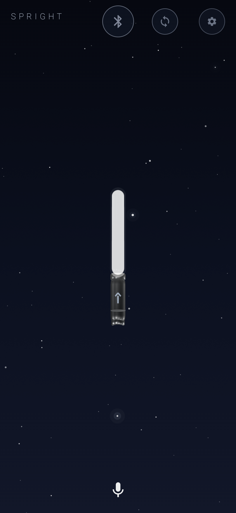
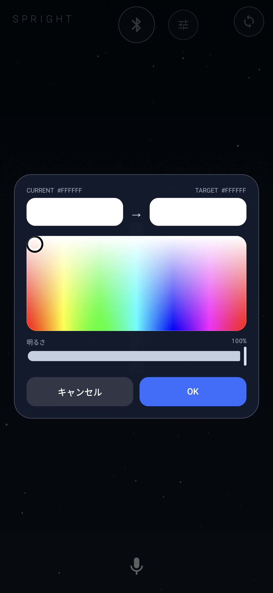
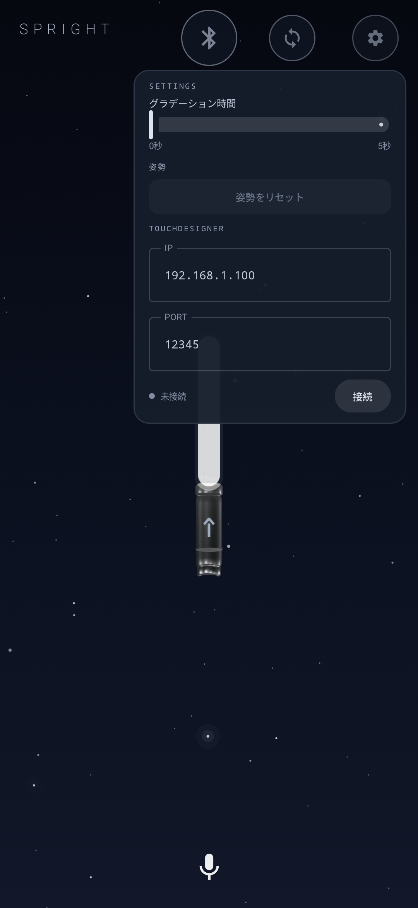

# Spright

Sprightは、BLE1507を搭載したペンライトをAndroidから操作するアプリです。日本語音声を色へ変換してPWMコマンドを送信し、33バイトのIMUパケットからroll / pitch / 相対yawを表示します。

<p align="center">
  
  
  
</p>

主な処理経路は次のとおりです。

```text
日本語音声
  ├─ 既知の絶対色       → ルール判定
  ├─ 相対調整           → 決定的なHSV相対変換
  └─ 抽象表現・未知語   → llama.cpp + ローカルQwen
                           └─ greedy生成 + 厳密な#RRGGBB抽出
                                      ↓
                            BLE1507 PWM書き込み

BLE1507 IMU (60 Hz)
  → パケット解析 → 同梱InertialMotionLib2 JNI
  → roll / pitch / 相対yaw → 10 Hz UI + CSV
```

## アプリの使い方

1. アプリを起動し、上部中央のBluetoothアイコンをタップします。橙色の接続処理を経て緑色になれば、BLE1507へ色コマンドを送信できます。接続直後には画面上の現在色を1回送信し、実機ペンライトと表示色をそろえます。
2. 中央のペンライト発光部をタップするとカラーマップが開きます。色相・彩度をマップ、明るさを下のスライダーで選び、`OK`で送信します。0%は消灯です。外側または`キャンセル`を押した場合は変更しません。
3. 下部のマイクをタップして、色の名前やイメージを日本語で話します。文字認識結果を先に表示し、ルールまたはローカルLLMが決めた`#RRGGBB`を続けて表示します。BLE書き込み成功後に実機と3Dモデルへ反映します。
4. Bluetoothアイコンと設定の間にある同期アイコンを押し、案内に従ってペンライトを机へ置きます。5秒間の静止確認中は加速度・ジャイロの大きさを小型グラフへ重ねて表示し、成功後は60 Hz IMUから推定した姿勢を3Dモデルへ反映します。
5. 右上の設定では、色変化にかける時間、現在姿勢のリセット、TouchDesigner TCP送信先のIP / Portを変更できます。姿勢リセットはIMU同期中の現在姿勢を3D表示の新しい原点にします。

### 展示担当者向け

- 左上の`SPRIGHT`ロゴを700 ms以内の間隔で5回タップすると、担当者パネルを開閉できます。BLE、IMU、音声認識、色解決経路、処理時間、モデル状態を確認できます。
- 音声を使えない場合も、中央の発光部をタップするカラーマップ操作は利用できます。
- BLEまたはIMUが途切れた場合は自動再接続します。5秒の静止確認中にIMUが届かない場合も待機を中断し、BLE再接続後にIMU開始コマンドを再送します。
- 展示前には「日本語オフライン音声認識の準備」の手順と、機内モード＋Bluetoothのみでの動作確認を行ってください。

## 必要環境

- Xperia 1 VIIなどのarm64 Android端末（本プロジェクトの`minSdk`は34）
- Android SDK 36
- Android NDK `29.0.13599879`
- JDK 17
- USBデバッグ用の`adb`
- モデル1個につき約400～570 MB、A/B評価時は合計約1 GBの空き容量

Gradle Wrapperと`llama.cpp`はリポジトリ側で固定しています。InertialMotionLib2はSprightが使うJNIブリッジ、ヘッダー、arm64ネイティブライブラリだけを直接同梱しており、`sprbox-SDK`サブモジュールは不要です。GGUFモデルはGitにもAPKにも含めません。
展示UIはKotlin 2.4.0とSceneView 4.22.0（Filament）でビルドします。

## クリーンクローンからのセットアップ

```bash
git clone --recurse-submodules https://github.com/NaitoMitsuharu/Spright.git
cd Spright
```

すでに通常cloneした場合は、次を一度実行します。

```bash
git submodule sync --recursive
git submodule update --init --recursive
```

Debug APKだけをビルドする場合:

```bash
./gradlew :app:assembleDebug
```

Windows PowerShellでは`./gradlew`を`.\gradlew.bat`に置き換えてください。
PowerShellで`-PcolorModel`の値に`.`を含む場合は、`"-PcolorModel=qwen3-0.6b"`のように引数全体を引用符で囲んでください。

## モデルの取得とインストール

候補モデルは固定revisionからダウンロードし、サイズとSHA-256を検証してGradleユーザーキャッシュへ保存します。

| ID | ファイル | サイズ | SHA-256 |
|---|---|---:|---|
| `qwen3-0.6b` | `Qwen3-0.6B-Q4_K_M.gguf` | 396,705,472 bytes | `ac2d97712095a558e31573f62f466a3f9d93990898b0ec79d7c974c1780d524a` |
| `qwen3.5-0.8b` | `Qwen3.5-0.8B-Q4_0.gguf` | 563,036,064 bytes | `57d1997790d1744fba5b40a7317df71ea5e2acee28c47e78f0cce39c0703f8cf` |

両候補の取得:

```bash
./gradlew downloadColorModels
```

選択した1モデルだけを準備:

```bash
./gradlew prepareColorModel -PcolorModel=qwen3-0.6b
./gradlew prepareColorModel -PcolorModel=qwen3.5-0.8b
```

APKのインストールとモデル転送:

```bash
./gradlew installDebug -PcolorModel=qwen3-0.6b
```

`installDebug`成功後、選択モデルは自動的に次へ転送されます。

```text
/sdcard/Android/data/com.example.ble1507/files/models/
```

転送完了後はSprightが自動的に再起動し、配置済みモデルを検出してwarmupします。これにより、ディレクトリ作成時に起動したプロセスが`Model: missing`状態を保持することを防ぎます。Androidの接続テストはアプリデータを削除する場合があるため、実機テスト後は`installDebug`または`pushColorModelDebug`を最後に実行してください。

APKを入れ直さずモデルだけ再転送する場合:

```bash
./gradlew pushColorModelDebug -PcolorModel=qwen3-0.6b
```

adb端末が複数ある場合はシリアル指定が必須です。

```bash
./gradlew installDebug -PcolorModel=qwen3-0.6b -PadbSerial=<serial>
```

端末未接続、複数接続でシリアル未指定、未知のモデルID、サイズ不一致、SHA-256不一致はタスクを失敗させます。

モデルキャッシュを削除する場合:

```powershell
Remove-Item -Recurse -Force "$HOME\.gradle\caches\spright\models"
```

```bash
rm -rf ~/.gradle/caches/spright/models
```

## モデルA/B評価

Xperia 1 VIIをUSB接続し、次を実行します。

```bash
./gradlew benchmarkColorModelsDebug -PadbSerial=<serial>
```

このタスクは両モデルを検証・転送し、32個のルール非該当日本語フレーズを各3回実行します。判定条件は以下です。

- `#RRGGBB`形式成功率: 100%
- 許容HSV範囲合格率: 90%以上
- 推論p95: 3,000 ms以内
- 合格モデルのうちp95が最短
- p95差が200 ms以内なら色合格率を優先し、さらに同率なら`qwen3-0.6b`

レポートは次へ回収されます。

```text
app/build/reports/color-model-benchmark/color-model-benchmark.csv
app/build/reports/color-model-benchmark/color-model-benchmark.json
```

### Xperia 1 VIIでの再評価結果

2026-07-21にXperia 1 VII（XQ-FS54、Android 16）で、ルールを必ず迂回する独立36件（development 20 / holdout 16）を追加して再評価しました。従来の32件×3回は速度・形式・回帰確認には使えますが、汎化精度の根拠にはしません。

| モデル | HEX成功率 | 独立36件の色域合格率 | 推論p95 | 判定 |
|---|---:|---:|---:|---|
| `qwen3-0.6b` | 100% | 41.67% | 559 ms | 速度合格・精度未達 |
| `qwen3.5-0.8b` | 100% | 27.78% | 3,182 ms | 精度・速度未達 |
| Qwen2.5-1.5B Q4_K_M（調査候補） | 100% | 69.44% | 542 ms | 最良精度だが90%未達 |
| Qwen2.5-3B Q4_K_M（調査候補） | 100% | 63.89% | 1,080 ms | 1.5Bより悪化 |

90%条件を満たす候補はありません。未合格モデルへの切り替えは行わず、配布設定は小さく高速な`qwen3-0.6b`のままです。展示時は「アプリ全体の色解決精度」と「LLM単体精度」を分けて説明してください。現在の本番経路156件（78件を現在色なし/ありで各1回）は97.44%、ルール75件は100%、その中のLLM 3件は33.33%でした。

## 展示UIとGLBペンライト

縦画面の展示UIは、2層の星空背景、上部中央のBLE・IMU同期・設定アイコン、中央のGLBペンライト、下部のアイコンだけの音声ボタンで構成しています。星空は動画ではなく、固定seedの点をCompose Canvasで描画するプロシージャルアニメーションです。2層を異なる周期のsin / cos軌道で循環させ、選択した星だけが低頻度で白い光暈を伴って瞬くため、ループ境界でも星が飛ばず連続して移動します。

- BLEアイコン: 切断中は灰色、接続処理中は橙色、ready時は緑色。タップで接続・切断を切り替えます。
- 同期アイコン: BLE未接続、未同期、キャリブレーション中、姿勢推定失敗、IMU更新停止時は灰色です。同期完了後に有効な姿勢推定が継続している間だけ緑色になり、最新推定から1秒を超えると灰色へ戻ります。
- GLB: 透明背景のSceneView 4.22.0で描画し、固定カメラ、Cinematic品質、Bloom、Filmic tone mappingを使用します。発光材質と2層のComposeぼかしレイヤーを重ね、現在色の光を発光管の外側へネオン状に広げます。先端は表示領域で切れない半球形です。
- 発光部タップ: Filament pickingで`Emitter`または`GlowShell`のentityだけを受理します。持ち手など別部品のタップではカラーメニューを開きません。
- 色反映: BLEの`onCharacteristicWrite`成功後にだけGLBのbase color / emissiveを更新します。失敗時は最後に成功した色を維持します。
- 上部アイコン: BLEアイコンは従来どおり上部中央、設定アイコンは右上、IMU同期アイコンはその2つの中間へ同じ中心線で配置します。設定のフローティングメニューでは、グラデーション時間、姿勢表示リセット、TouchDesignerのIP / Portを操作できます。姿勢リセットは同期済みで有効な姿勢がある場合だけ使用でき、押した瞬間のroll / pitch / yawを3Dモデルの新しい基準姿勢にします。グラデーション初期値の0秒は1命令で即時変更し、それ以外はカラーマップ操作・音声操作のどちらもHSV色相の最短経路を50 ms間隔（20段階/秒、最大100段階）で送ります。選択値はアプリ起動中だけ保持されます。BLE書き込みは1本のキューで直列化し、遅延した中間色は飛ばして最終色へ追いつきます。
- 姿勢反映: 同期成功後のroll / pitch / 相対yawをZYX順のQuaternionへ変換し、受信周期に追従して持ち手内部の`SpresensePivot`親Nodeへ渡します。GLB本体はその子として上へオフセットし、モデル中央ではなく持ち手中央下寄りを実際の回転中心にします。描画フレームごとの最短経路Quaternion補間でセンサーノイズや通知ジッターによる段差を抑えます。持ち手正面の非対称な矢印マーカーにより、回転方向を判別できます。
- IMU同期案内: リロード記号ではなく、ペンライトが傾いた状態から水平な机へ置かれるアニメーションを表示します。
- カラーメニュー: 見出しや閉じるアイコンを置かず、現在色と指定色、カラーマップ、`キャンセル` / `OK`だけを表示します。外側タップまたは`キャンセル`では変更せず、`OK`で共通の色送信経路へ渡します。
- 音声結果: 音声認識確定時に、まず音声ボタンの上へ枠やカギ括弧なしの灰青色文字列を表示します。LLM推論中は下のカラーコード専用スロットにローディングを表示し、完了時にHEXコードと実色スウォッチへ置き換えます。音声ボタン周囲のローディングは音声入力・文字認識中だけに限定し、LLM推論・BLE送信中は非表示にします。ただし一連のBLE送信が完了するまで音声ボタン自体は無効です。文字列とカラーコードには固定高の別スロットを割り当てるため、推論完了時にも文字列が動きません。文字列は長さに応じて縮小し、最大2行を超える部分は省略します。入力ダイアログでは途中結果が得られた場合だけ表示し、空のプレースホルダー文言は表示しません。ルール / LLM、音声認識・推論・BLE・合計時間は担当者パネルだけに表示します。
- 担当者パネル: Debug / Releaseのどちらも通常は非表示です。左上の`SPRIGHT`ロゴを700 ms以内の間隔で5回タップすると、接続、現在色、音声認識と色解決詳細、実測IMU受信Hz、Euler角、システム状態、日本語音声パック取得、現在姿勢を表示基準にする操作、画面固定操作を区分表示します。同じ操作で閉じます。姿勢表示リセットはnative推定やIMU受信を止めず、現在のQuaternionをアプリ側表示原点にするだけです。
- アプリアイコン: 展示画面と同じ夜空、単一の発光ペンライト、黒鉛色の持ち手、yaw矢印を使った低彩度のadaptive iconです。

### 展示モードと自動復旧

- `MainActivity`は縦画面・single taskで起動し、画面点灯維持と没入全画面表示を適用します。別画面から戻った場合も全画面表示を再適用します。
- Device OwnerからSprightがLock Task許可されている端末は起動時に自動でKioskへ入ります。通常のXperiaでは担当者パネルの`画面固定を開始`を押し、Androidの確認に従って画面を固定してください。
- 通知の完全な遮断はアプリ単体では許可されません。展示前にAndroidのサイレントモードを有効にし、着信・通知の例外が残っていないことを端末設定で確認してください。
- 利用者がBLE接続を有効にするとその意図を保存します。予期しない切断後は1、2、4、8、15秒（以後15秒）の間隔で、最後のBLE1507への直接再接続または再スキャンを行います。BLEアイコンから明示的に切断すると自動再接続も停止します。
- IMU同期後に予期しないBLE切断が発生した場合は姿勢推定器と相対yawを保持し、BLE ready復帰時に`imu start`を自動再送します。明示的なBLE切断ではIMUも停止します。
- 音声入力8秒、音声認識結果6秒、LLM推論3秒、BLE書き込み3秒を上限にします。グラデーション全体は選択時間にBLE書き込み3秒の猶予を加えた値（最低5秒）を上限にします。タイムアウトまたはエラー時は原因を画面に残し、2.5秒後に`Idle`へ戻してマイクを再操作可能にします。
- 音声認識に失敗しても発光部タップのカラーマップは独立して利用できます。失敗した音声結果からBLE色コマンドは送信しません。

### 日本語オフライン音声認識の準備

日本語音声パックはAndroidの音声認識サービスが管理するため、APKから無確認でダウンロードすることはできません。

1. ネットワークへ接続した状態で、`SPRIGHT`ロゴを5回タップします。
2. 担当者パネルが`日本語音声パック準備済み`なら操作は不要です。起動時にAndroid音声サービスへインストール済み言語を照会します。未準備の場合だけ`日本語音声パック取得`を1回押してください。進行率または予約状態を表示し、成功または予約後は状態をアプリ設定へ保存してボタンを無効化します。音声サービスが後から「未インストール」を返した場合だけ再取得可能へ戻ります。端末の音声サービスがモデル取得APIを提供しない場合は音声入力設定を開きます。
3. Sprightへ戻り、モデルwarmupとBLE接続が完了したことを確認します。
4. 機内モードを有効にした後でBluetoothだけを有効へ戻し、日本語音声入力、カラーマップ操作、BLE送信、IMU同期を確認します。
5. 音声パックがない場合は原因と設定ボタンが画面へ表示され、処理は固まらず`Idle`へ戻ります。

2026-07-18にXperia 1 VIIで上記の取得操作を実行し、Android音声サービスが提示した日本語（日本）オフライン更新51.53 MBをダウンロードして、アプリの`onSuccess`まで確認しました。その後、元の通信設定を保存して機内モード＋Bluetoothのみへ一時的に切り替え、オフライン音声入力の開始、無音時の8秒タイムアウト、原因表示、`Idle`復帰、エラー表示中のカラーマップ操作を確認し、試験後に機内モードOFF・Bluetooth ONへ復元しました。実際の日本語発話の認識精度は、展示前に会場と同程度の騒音環境で別途確認してください。

GLB本体は`app/src/main/assets/models/spright_penlight.glb`です。Blenderなしで同じモデルを再生成できます。

```bash
python tools/generate_penlight_glb.py
```

GLBのノード名はアプリとの契約です。変更する場合はアプリ側と契約テストも同時に更新してください。

| ノード | 用途 |
|---|---|
| `SprightRoot` | IMU姿勢を適用するルート |
| `Handle` | 黒鉛色の持ち手 |
| `Collar` / `Button` / `EndCap` | 金属・樹脂部品 |
| `Emitter` | 半透明の発光チューブ |
| `GlowShell` | Bloom用の外側発光層 |
| `YawMarker` / `YawMarkerLeft` / `YawMarkerRight` | 持ち手正面と回転方向を示す非対称矢印 |

GLBのロードに失敗した場合は、Compose製ペンライトシルエットとエラー表示へ自動的に切り替わります。

## 音声色制御

- 音声認識は日本語のオンライン認識を優先します。
- ネットワークまたは認識サーバーが利用不能の場合だけオフライン認識へ1回フォールバックします。
- 基本色は部分文字列では判定せず、「青」「青色にしてください」のように助詞・依頼語を除いた直接指定と一致した場合だけルールで即時処理します。「緑と青の間」「赤と青を混ぜた」のように複数の基本色と混色意図を含む発話は、基本色ルールを迂回してローカルLLMへ渡します。固有色名や修飾語付きの絶対色は下記の決定的ルールを引き続き使用します。
- 混色発話では、検出した基本色のHEXを推論コンテキストへ提示します。小型LLMの出力が光の加法混色として明らかに矛盾する場合だけ正規化加算色へ補正し、sourceを`additive-guard`付きで記録します。これにより誤色をBLEへ送らず、展示時にもLLM単独出力と補正結果を区別できます。
- モデルのchat templateを`llama.cpp`で適用し、絶対色用の静的system promptのKV cacheを再利用します。
- 絶対色はgreedy生成し、最初の大文字`#RRGGBB`だけを厳密に抽出・検証します。HEX文法を先頭トークンから強制すると小型モデルが`#000000`へ偏ったため使用していません。JSONの解析や再試行は行いません。
- LLMが選んだ意味上の色相を保ったまま、発話文字列から決定的に求めた小さなHSV補正（色相±6度、彩度・明度±6%）を加えます。固定パレットへの集中を避けつつ、同じ発話は毎回同じ色になります。
- ブランド、食べ物、和色、キャラクター、明示的な感情名など、代表色が定義できる固有語は参照色で決定的に解決します。未知語、比喩、複数の意味を含む抽象表現はLLMへ渡します。
- 「もっと濃く」「少し明るく」「もう少し赤っぽく」「青みを20%足して」「赤みを抑えて」のような明示的な相対命令は、HSVの決定的な相対変換で即時処理します。実機調査で小型LLMの相対出力がほぼ定数であり、最終結果は全件ルール補正だったため、実質的な寄与のない推論を本番経路から外しました。
- Xperia 1 VIIでの相対命令12件は方向精度100%、ルール経路率100%、p95 1 msです。LLMは自然物・感情・比喩など、意味解釈が必要な絶対色だけを担当します。
- 独立36件でのLLM単体精度は上記のとおり90%未達です。過去の小規模・調整済み評価を「LLM精度100%」の根拠にはしません。
- 起動時warmupが完了するまでVoiceボタンは「モデル準備中」になります。
- 意味解釈LLMが返した`#000000`は推論失敗として扱い、BLEへ送信しません。黒・消灯の明示命令はルール経路でのみ許可し、小型モデルの黒への退避で意図せず消灯することを防ぎます。
- 解決失敗時は現在色を維持し、BLEへ送信しません。
- 有効な音声結果は現在色と同じ場合もPWMを書き込みます。

画面と`SprightLatency`ログには、`onEndOfSpeech`からBLE `onCharacteristicWrite`までの内訳を表示します。成功・失敗を含む実機記録は端末上の次のCSVへ追記されます。

```text
/sdcard/Android/data/com.example.ble1507/files/benchmarks/voice-e2e.csv
```

20回以上の測定後にCSVの`gatt_success=true`を対象として、`total_ms`の中央値3,000 ms以内、p95 5,000 ms以内を確認してください。速度保証の対象はwarmup完了後かつ安定したオンライン音声認識環境です。

## TouchDesigner TCP連携

右上の設定アイコンを開き、TouchDesigner側TCPサーバーの数値IPアドレスとPortを入力して「接続」を押します。初期値は参照元`SpresenseDroidPractice`と同じ`192.168.1.100:12345`です。IP / Portは`SharedPreferences`へ保存され、次回起動時にも復元されます。通信はUDP / OSCではなく、AndroidをclientとするTCPソケットです。

姿勢は`ImuNativeAttitudeEstimator.update(packet)`が返した`AttitudeEstimate.rollDeg / pitchDeg / yawDeg`の最新値を最大約58.8 Hz（17 ms間隔）で送ります。参照元と互換の`data.imu_values`は配列ではなくカンマ区切り文字列です。

```json
{"cmd":"send_imu_values","timestamp":1725000123456,"data":{"imu_values":"12.5,-3.25,179.0"}}
```

BLE書き込み成功後に画面へ確定した現在色は10 Hz（100 ms間隔）で別メッセージとして送ります。グラデーション中は、その時点で最後にBLE送信成功した色の最新値になります。

```json
{"cmd":"send_color_value","timestamp":1725000123456,"data":{"color":"#03A7EF"}}
```

どちらもUTF-8でエンコードし、1 JSONごとに末尾へ改行`\n`を付けます。姿勢・色のproducerはAtomicな最新値を置き換えるだけで、実際の接続と書き込みは専用単一ネットワークスレッドが直列処理します。未接続時や送信失敗時は値を破棄し、IMU推定・BLE制御を待たせません。接続が切れた場合は設定内へエラーを表示し、「接続」から再試行します。

## IMU姿勢推定

- 展示UIの同期ボタンを押すとIMUを開始し、確認後に5秒間（60 Hzで約300サンプル、最低180サンプル）の緩やかな静止確認を行います。
- 5秒の収集中は、各パケットの`√(ax²+ay²+az²)`と`√(gx²+gy²+gz²)`をそれぞれ加速度・ジャイロの大きさとして約20 Hzで画面へ反映します。単位と値域が異なるため系列ごとに独立して正規化し、同じ小型リアルタイムグラフへ水色と紫色の線だけを重ねます。凡例・数値・サンプル件数は展示UIへ表示しません。最大300点を保持するため、描画更新がIMU処理を圧迫しません。
- 最初のIMUサンプルが1.2秒以内に来ない場合、または受信開始後に750 ms以上更新が止まった場合は5秒待機を即時中断します。サンプル総数が最低180件に届かなかった場合も取得失敗として扱い、利用者へ理由を表示してBLEを切断・即時自動再接続し、ready復帰後に`imu stop` / `imu start`を再送します。
- 合格条件はgyro magnitude p95 `< 0.20 rad/s`、加速度ノルム平均`7.0～12.5 m/s²`、標準偏差`< 0.75 m/s²`です。
- 合格時はnativeキャリブレーションAPIの成否を同期条件にせず、アプリ側の相対yaw基準だけをリセットします。姿勢推定から有効値が継続して得られた場合に同期アイコンが緑になります。
- 静止状態を確認できない場合はGLB姿勢を有効にせず、再試行またはキャンセルを表示します。
- SDKのnativeキャリブレーション経路は診断用に残しますが、展示UIからは呼び出しません。
- BLE1507の現行33バイトパケット順をidentity軸として使用
- サンプリング60 Hz
- timestampは19.2 MHzのunsigned 32-bit tickを秒へ変換し、wrap後も単調化
- accelはm/s²、gyroはrad/sとしてSDKへ入力
- SDKのEuler rad出力をdegreeへ変換
- 最初の有効yaw（キャリブレーション直後は次の有効yaw）を0度として`[-180, 180)`へ正規化
- BLE受信後の姿勢更新とCSV書き込みは専用single threadで直列処理
- 3D姿勢の目標値は最大約60 Hzで更新し、描画フレーム間をQuaternion補間。担当者パネルの数値だけ約10 Hz、CSV flushは約1秒間隔

yawは地磁気を使用しないため絶対方位ではありません。短時間の相対回転として扱います。センサー軸が実際のペンライト座標と一致しないことが軸回転試験で確認された場合だけ、固定軸変換を追加してください。

直接同梱している`libinertialmotionlib2.so`は`SpresenseDroidPractice`と同じlegacy ABIを使用します。特にCヘッダーの`IML_FLOAT64`は名称に反して`float`です。これを`double`へ変更するとIMU、Euler、Quaternionの構造体レイアウトがバイナリと一致せず、更新成功に見えても角度が0のままになります。JNIは参照実装と同様にライブラリ内singletonを使用します。推定開始時は未キャリブレーションでも動作できるよう加速度・ジャイロbiasを0、Quaternionをidentityへ初期化します。同梱元は`EdgeAI-BestPractices/sprbox-SDK` commit `c1d5bc14d407d51102767b4188867fc6ea620e91`です。

注意: 直接同梱したprebuilt `libinertialmotionlib2.so`はELFの`LOAD` alignmentが4 KBです。現在のAndroid Lintはアプリ内へ直接配置したこのバイナリを`Aligned16KB`として報告しませんが、実バイナリの制約は残っています。JNIラッパーやAPKの設定だけでは修正できないため、16 KBページ端末を正式対応する前に、提供元のソースから`-Wl,-z,max-page-size=16384`を含む現行NDKでライブラリ本体を再ビルドしてください。現在のXperia 1 VII実機で動くことと、将来の16 KBページ端末でロードできることは別に検証します。

IMUログ:

```text
/sdcard/Android/data/com.example.ble1507/files/imu-logs/imu-attitude-latest.csv
```

実機確認の目安:

- 静止時roll / pitch: ±5度
- 各軸を約90度回転: ±10度
- 相対yaw: 回転方向がペンライト座標と一致

初期化、update、calibration、Euler取得の失敗理由はUIと`SprightImuBridge` / `SprightImu`ログへ出力されます。

Xperia上で実際のnativeライブラリへ合成BLEパケットを入力する試験:

```bash
./gradlew :app:assembleDebug :app:assembleDebugAndroidTest
adb install -r app/build/outputs/apk/debug/app-debug.apk
adb install -r app/build/outputs/apk/androidTest/debug/app-debug-androidTest.apk
adb shell am instrument -w \
  -e class com.example.ble1507.InertialMotionLibSyntheticInstrumentedTest \
  com.example.ble1507.test/androidx.test.runner.AndroidJUnitRunner
```

60 Hz、19.2 MHz timestamp、accel m/s²、gyro rad/sでのXperia 1 VII実測は、roll `89.994°`、pitch `90.000°`、相対yaw `90.003°`でした。レポートは端末の`files/benchmarks/inertial-motion-lib2-synthetic.json`に保存されます。pitchが±90度のときはEuler角の特異点によりroll/yawを一意に定められないため、pitch値そのものを評価してください。

## テスト

ローカル単体テスト、Debug APK、計測テストAPKのコンパイル:

```bash
./gradlew :app:testDebugUnitTest :app:assembleDebug :app:assembleDebugAndroidTest
```

単体テストには、IMUパケット解析、timestamp wrapと単調化、rad→degree前提値、yaw正規化、LLM HEX出力検証を含みます。実モデルの色精度と端末速度は`benchmarkColorModelsDebug`、音声認識とBLEを含むE2Eは`voice-e2e.csv`で評価します。

展示UIのCompose計測テストを実機で単独実行する場合:

```bash
adb shell input keyevent KEYCODE_WAKEUP
adb shell wm dismiss-keyguard
adb shell am instrument -w -r \
  -e class com.example.ble1507.ExhibitionScreenInstrumentedTest \
  com.example.ble1507.test/androidx.test.runner.AndroidJUnitRunner
```

このテストはカラーメニューの現在色・指定色・簡略化した決定操作、共通グラデーション設定、音声入力中UI、キャリブレーション確認UI、GLBロード失敗時のfallbackを検証します。端末がスリープ中だとCompose hierarchyを取得できないため、先に画面を起こしてください。

カテゴリ別のアプリ総合精度をXperia上で再評価する場合:

```bash
adb shell am instrument -w \
  -e class com.example.ble1507.BroadColorAccuracyInstrumentedTest \
  -e minAccuracy 0.95 \
  com.example.ble1507.test/androidx.test.runner.AndroidJUnitRunner
```

端末上のレポートは`files/benchmarks/broad-color-accuracy.json`へ保存されます。

## ライセンス

- Sprightアプリコード: MIT
- llama.cpp: MIT
- Qwen候補モデル: Apache 2.0
- InertialMotionLib2 JNI / native binary: 利用許諾に基づきSprightへ直接同梱（出典commitは上記参照）
